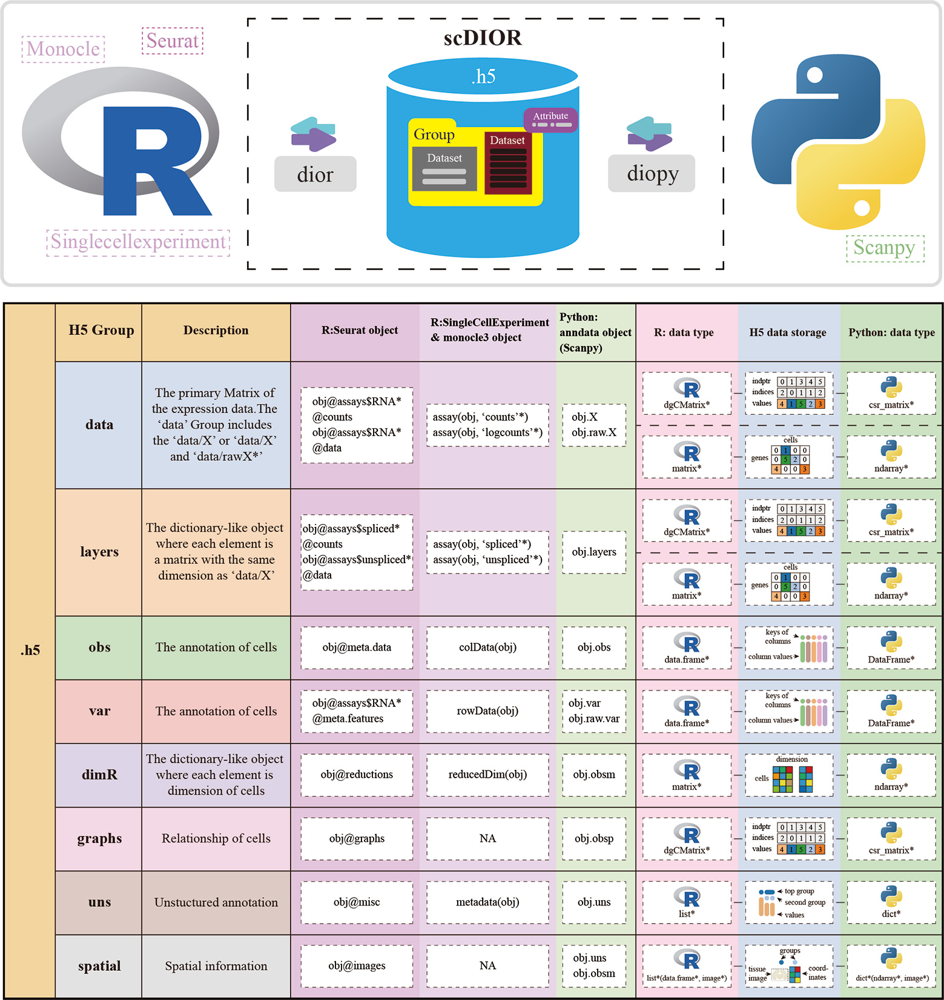
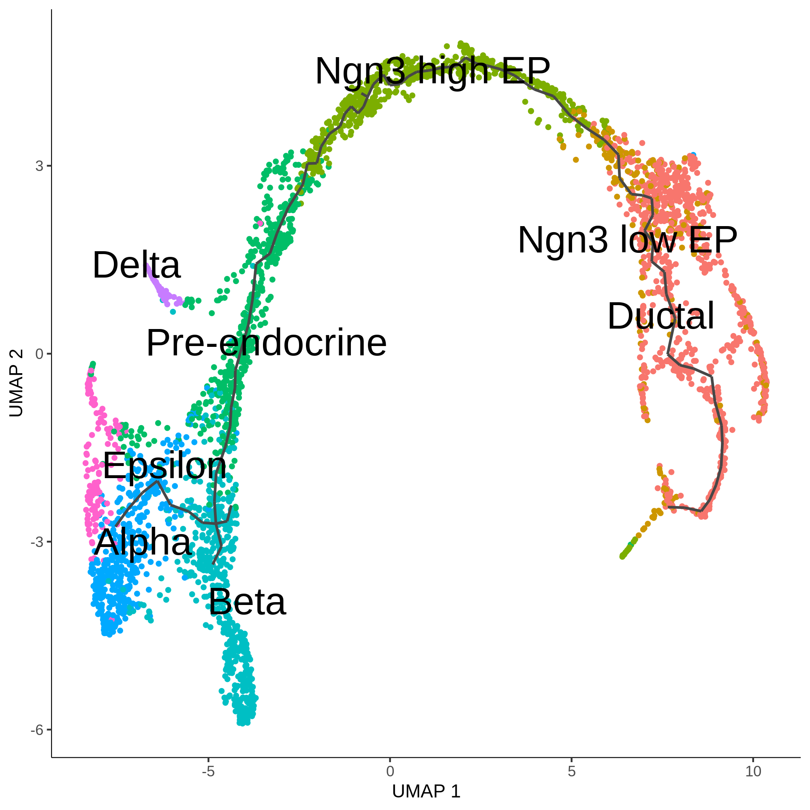
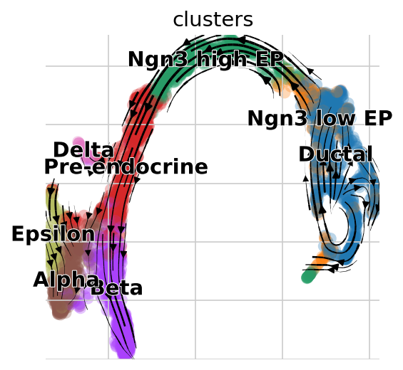
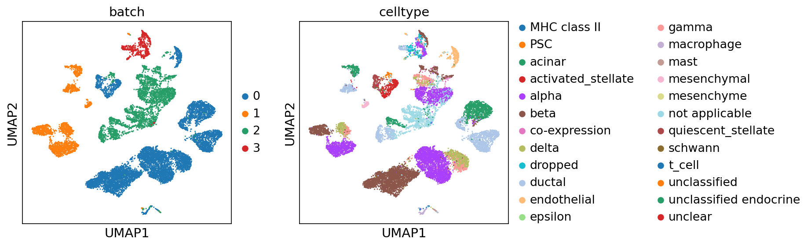
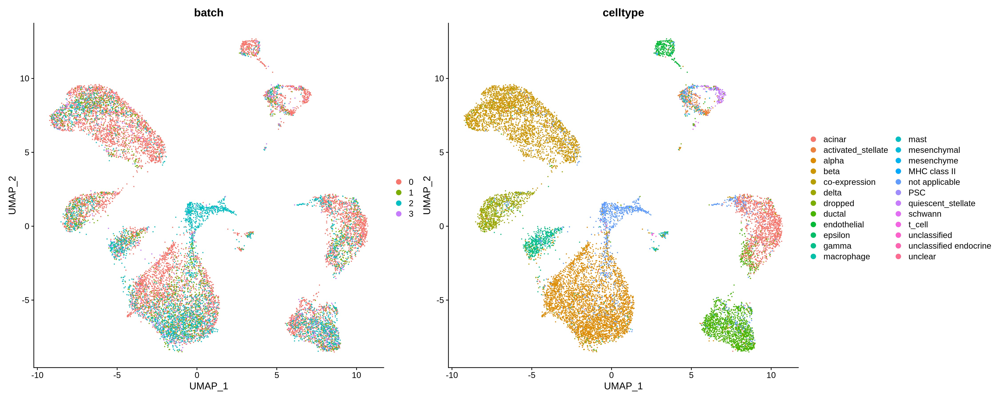
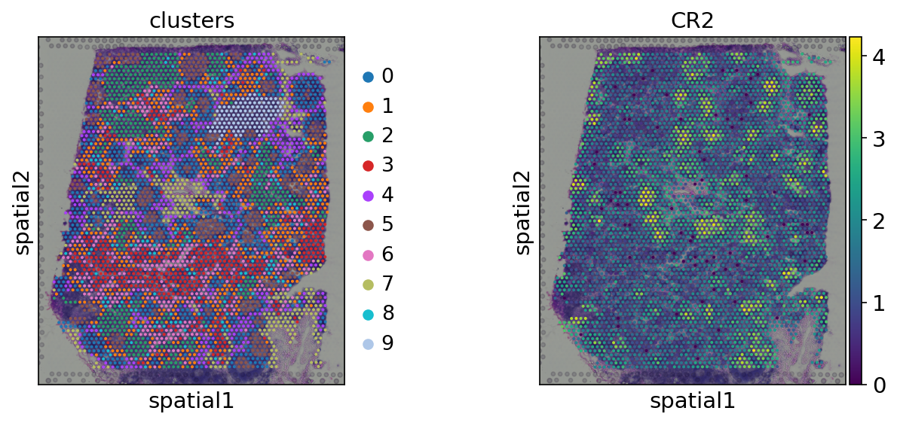
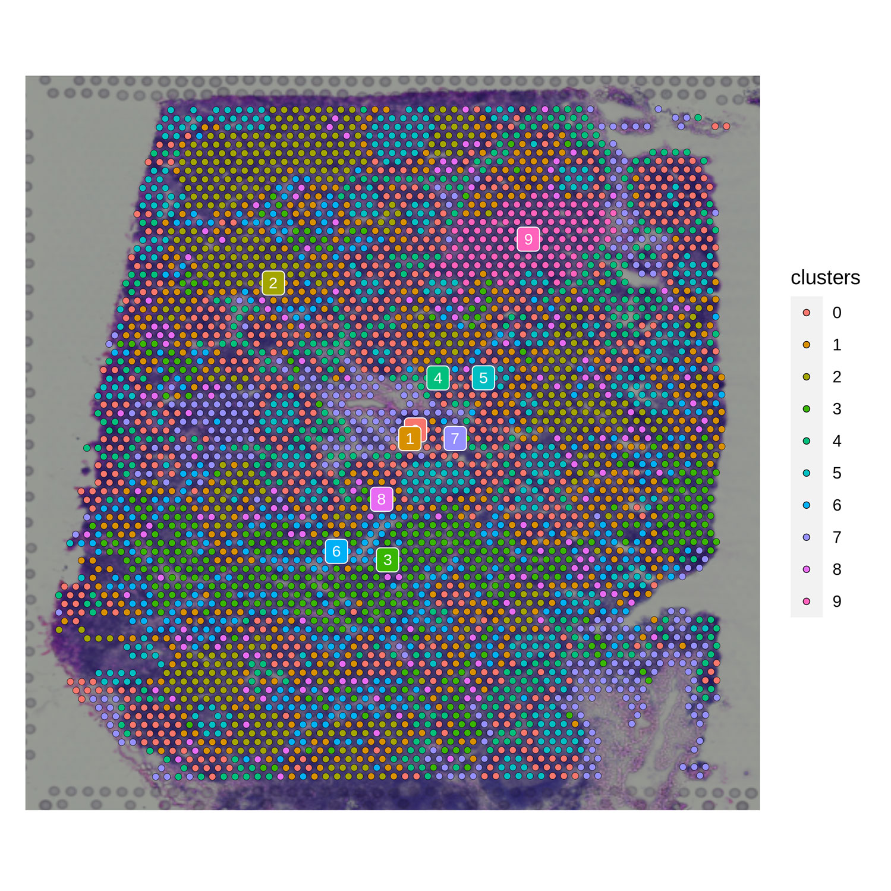
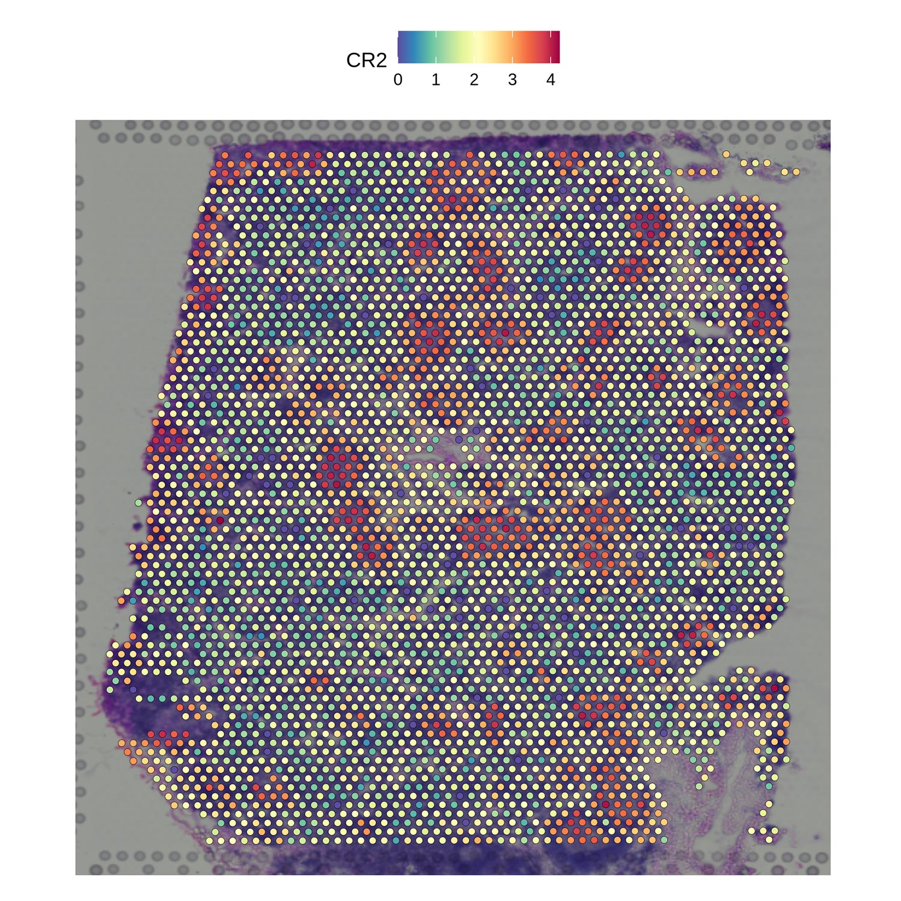

# scDIOR
scDIOR: Single cell data IO softwaRe


## Overview

scDIOR software contains two modules, dior for R and diopy for Python. The data transformation was implemented by a ‘.h5’ file of [HDF5](https://www.hdfgroup.org/) format, which harmonizes the different data types between R and Python. The different aspects of single-cell information were stored in HDF5 group with dataset. scDIOR creates 8 HDF5 groups to store core single-cell information, including data, layers, obs, var, dimR, graphs, uns and spatial.   




## Preparation

### R installation

```R
# ~/.conda/envs/vev1/bin/R

install.packages('devtools')
devtools::install_github('JiekaiLab/dior')
# or devtools::install_github('JiekaiLab/dior@HEAD')
```

### R loading packages

```R
# ~/.conda/envs/vev1/bin/R
library(Seurat)
library(SingleCellExperiment)
library(dior)
library(monocle3)
library(ggplot2)
```

### Python installation

`pip` is recommended

```shell
pip install diopy
```

### Python loading packages

```python
# ~/.conda/envs/vev1/bin/python
import scipy
import scanpy as sc
import pandas as pd
import numpy as np
import scvelo as scv
import diopy
```


## Getting started

Here, we list the three specific examples and the extended function to show the powerful performance of scDIOR.

* The three examples: 
  1. One can perform trajectory analysis using Monocle3 in R, then transform the single-cell data to Scanpy in Python using scDIOR, such as expression profiles of spliced and unspliced, as well as cell layout. The expression profile can be used to run dynamical RNA velocity analysis and results can be projected on the layout of Monocle3.
  2. One can employ single-cell data preprocess and normalization method provided by Scanpy, and utilize batches correction method provided by Seurat.
  3. scDIOR supports spatial omics data IO between R and Python platforms.

* The extended function:
  1. the function to load ‘.rds’ file in Python directly;
  2. the function to load ‘.h5ad’ file in R directly;
  3. command line  

___

____

___

## Example A

One can perform trajectory analysis using Monocle3 in R, then transform the single-cell data to Scanpy in Python using scDIOR, such as expression profiles of spliced and unspliced, as well as cell layout. The expression profile can be used to run dynamical RNA velocity analysis and results can be projected on the layout of Monocle3.

### Load the data with`scvelo` in `Python`

This data is curated by the `scvelo`, loaded by the code:

```shell
# ~/.conda/envs/vev1/bin/python
adata = scv.datasets.pancreas()
adata
# AnnData object with n_obs × n_vars = 3696 × 27998
#     obs: 'clusters_coarse', 'clusters', 'S_score', 'G2M_score'
#     var: 'highly_variable_genes'
#     uns: 'clusters_coarse_colors', 'clusters_colors', 'day_colors', 'neighbors', 'pca'
#     obsm: 'X_pca', 'X_umap'
#     layers: 'spliced', 'unspliced'
#     obsp: 'distances', 'connectivities'
```

### Save the data with `diopy` in `Python`

```Python
# ~/.conda/envs/vev1/bin/python
diopy.output.write_h5(adata = adata, 
                      file = './result/py_write_h5/data_write_velocity.h5')
```

### Load the data with`dior` in `R`

```R
# ~/.conda/envs/vev1/bin/R
sce <- read_h5(file= '.result/py_write_h5/data_write.h5', 
              target.object = 'singlecellexperiment')
cds  <- new_cell_data_set(sce@assays@data@listData$X,
                         cell_metadata = colData(sce),
                         gene_metadata = rowData(sce))
```

* Constructing single-cell trajectories by `monocle3`. More details are available at [monocle3](https://cole-trapnell-lab.github.io/monocle3/docs/trajectories/)

1. Pre-process the data

```R
# ~/.conda/envs/vev1/bin/R
cds <- preprocess_cds(cds, 
                      num_dim = 50)
```

2.  Dimensionality reduction 

```R
# ~/.conda/envs/vev1/bin/R
cds <- reduce_dimension(cds)
```

3. Clustering  the cells 

```R
# ~/.conda/envs/vev1/bin/R
cds <- cluster_cells(cds, 
                     cluster_method= 'leiden')
```

4. Learning the trajectory graph and visualization

```R
# ~/.conda/envs/vev1/bin/R
cds <- learn_graph(cds)
plot_cells(cds,
           color_cells_by = "clusters",
           label_groups_by_cluster=FALSE,
           label_leaves=FALSE,
           label_branch_points=FALSE,
           reduction_method = 'UMAP',
           cell_size = 1, 
           group_label_size =8)
```



5. Adding the Dimension

```R
# ~/.conda/envs/vev1/bin/R
reducedDim(sce,'PCA') <- reducedDim(cds, 'PCA')
reducedDim(sce,'UMAP') <- reducedDim(cds, 'UMAP')
reducedDimNames(sce)<- c('pca','umap','mono_PCA','mono_UMAP')
```

### Save the data with`dior` in `R`

```R
# ~/.conda/envs/vev1/bin/R
write_h5(data = sce, 
         file = './result/r_monocle3_result/cds_trajectory.h5', 
         assay.name = 'RNA' ,
         object.type = 'singlecellexperiment')
```

### Load the `cds_trajectory.h5` with `diopy` in `Python`

```python
# ~/.conda/envs/vev1/bin/Python
mono = diopy.input.read_h5(file = './result/r_monocle3_result/cds_trajectory.h5')
```

* RNA Velocity analysis. More details are available at [scvelo](https://scvelo.readthedocs.io/VelocityBasics/)

1. Preprocess the Data

```python
# ~/.conda/envs/vev1/bin/Python
scv.pp.filter_and_normalize(mono, 
                            min_shared_counts=20, 
                            n_top_genes=2000)
scv.pp.moments(mono, 
               n_pcs=30, 
               n_neighbors=30)
```

2. Estimate RNA velocity

```python
# ~/.conda/envs/vev1/bin/Python
scv.tl.velocity(mono)
scv.tl.velocity_graph(mono)
```

3. Project the velocities

```Python
# ~/.conda/envs/vev1/bin/Python
scv.pl.velocity_embedding_stream(mono, 
                                 basis='mono_umap',
                                 save='.scvelo_trajectory.png')
```




____

____

___

## Example B

One can employ single-cell data preprocess and normalization method provided by Scanpy, and utilize batches correction method provided by Seurat.

### Load the data with `diopy`in `Python`

The data is curated by `scanpy`, loaded by the code:

```python
# ~/.conda/envs/vev1/bin/Python
adata_all = sc.read('data/pancreas.h5ad',
                    backup_url='https://www.dropbox.com/s/qj1jlm9w10wmt0u/pancreas.h5ad?dl=1')
```

1. Visualization

```python
# ~/.conda/envs/vev1/bin/Python
sc.pl.umap(adata_all, 
           color=['batch', 'celltype'], 
           palette=sc.pl.palettes.vega_20_scanpy)
```



### Save the data by `diopy` in `Python`

```python
# ~/.conda/envs/vev1/bin/Python
diopy.output.write_h5(adata_all, 
                      file = './result/batch_effect_data.h5', 
                      save_X=False) # Select not to save adata_all.X, because that's scale data,
```

### Load the data by `dior` in `R`

```R
# ~/.conda/envs/vev1/bin/R
data_batch <- read_h5(file = './result/batch_effect_data.h5',
                      assay.name = 'RNA', 
                      target.object = 'seurat')

data_batch@meta.data$batch <- as.character(data_batch@meta.data$batch)
```

* Batch effect corrected by Seurat protocol. More details are available at [Seurat](https://satijalab.org/seurat/articles/get_started.html)

1. Dataset preprocessing: Splitting the combined object into a list

```R
# ~/.conda/envs/vev1/bin/R
db_list <- SplitObject(data_batch, 
                       split.by = "batch")
```

2. Dataset preprocessing:  Variable feature selection based on a variance stabilizing transformation (`"vst"`) 

```R
# ~/.conda/envs/vev1/bin/R
db_list <- lapply(X = db_list, FUN = function(x) {
    # x <- NormalizeData(x) The data is normal data and does not need to be normalized
    x <- FindVariableFeatures(x, 
                              selection.method = "vst", 
                              nfeatures = 2000)
})
```

3. Select integration features

```R
# ~/.conda/envs/vev1/bin/R
features <- SelectIntegrationFeatures(object.list = db_list)
```

4. Integration of cell datasets

```R
# ~/.conda/envs/vev1/bin/R
db_anchors <- FindIntegrationAnchors(object.list = db_list,
                                     anchor.features = features)
db_combined <- IntegrateData(anchorset = db_anchors)
```

5.  Downstream analysis for Integration data

```R
# ~/.conda/envs/vev1/bin/R
DefaultAssay(db_combined) <- "integrated"
db_combined <- ScaleData(db_combined, verbose = FALSE)
db_combined <- RunPCA(db_combined, npcs = 30, verbose = FALSE)
db_combined <- RunUMAP(db_combined, reduction = "pca", dims = 1:30)
```

6.  Visualization 

```R
# ~/.conda/envs/vev1/bin/R
options(repr.plot.width=20, repr.plot.height=8)
DimPlot(db_combined, reduction = "umap", group.by = c("batch", 'celltype'))
```




___

___

___

## Example C

### Load the data from 10X Genomics Spatial Datasets

Downloading the spatial data set from [10X Genomics Spatial Datasets](https://support.10xgenomics.com/spatial-gene-expression/datasets)

* Analysis and visualization of spatial transcriptomics data by [scanpy spatail](https://scanpy-tutorials.readthedocs.io/en/latest/spatial/basic-analysis.html)

1. Reading the data

```python
# ~/.conda/envs/vev1/bin/Python
adata = sc.read_visium('./data/V1_Human_Lymph_Node')
adata.var_names_make_unique()
adata.var["mt"] = adata.var_names.str.startswith("MT-")
sc.pp.calculate_qc_metrics(adata, qc_vars=["mt"], inplace=True)
```

2. QC and preprocessing

```python
# ~/.conda/envs/vev1/bin/Python
sc.pp.filter_cells(adata, min_counts=5000)
sc.pp.filter_cells(adata, max_counts=35000)
adata = adata[adata.obs["pct_counts_mt"] < 20]
print(f"#cells after MT filter: {adata.n_obs}")
sc.pp.filter_genes(adata, min_cells=10)
```

3.  Normalize Visium counts data 

```python
# ~/.conda/envs/vev1/bin/Python
sc.pp.normalize_total(adata, inplace=True)
sc.pp.log1p(adata)
sc.pp.highly_variable_genes(adata, flavor="seurat", n_top_genes=2000)
```

4. Manifold embedding and clustering 

```python
# ~/.conda/envs/vev1/bin/Python
sc.pp.pca(adata)
sc.pp.neighbors(adata)
sc.tl.umap(adata)
sc.tl.leiden(adata, key_added="clusters")
```

5. Visualization in spatial coordinates

```python
# ~/.conda/envs/vev1/bin/Python
sc.pl.spatial(adata, img_key="hires", color=["clusters", "CR2"], save='.spatial_py_cluster_gene.png')
```



### Save the data by `diopy` in `Python`

```python
# ~/.conda/envs/vev1/bin/Python
diopy.output.write_h5(adata=adata, 
                      file='./result/spatial_data_scanpy.h5',
                      assay_name='spatial')
```

### Load the data by `dior` in `R`

```R
# ~/.conda/envs/vev1/bin/R
sp_data = read_h5(file = './result/spatial_data_scanpy.h5', 
                  assay.name = 'spatial')
```

1. Visualization in spatial coordinates

```R
# ~/.conda/envs/vev1/bin/R
options(repr.plot.width=8, repr.plot.height=8)
SpatialDimPlot(sp_data, 
               label = TRUE, 
               label.size = 3, 
               group.by='clusters',  
               pt.size.factor = 1)
```



```R
# ~/.conda/envs/vev1/bin/Python
SpatialFeaturePlot(sp_data, 
                   features = c('CR2'), 
                   pt.size.factor = 1)
```




### Save the data by `dior` in `R`

```R
# ~/.conda/envs/vev1/bin/Python
write_h5(sp_data, 
         file = './result/spatial_data_scanpy_v2.h5', 
         assay.name = 'spatial')
```

load the data by diopy in Python

```python
# ~/.conda/envs/vev1/bin/Python
sp_data = diopy.input.read_h5(file = './result/spatial_data_scanpy_v2.h5',
                              assay_name='spatial')
```

___

____

____

## scDIOR extended function

### scDIOR read h5ad file

Reading the h5ad file in R. `dior::read_h5ad` function will create a file with `_tmp.h5` suffix.

```R
# ~/.conda/envs/vev1/bin/R
bd = read_h5ad(file = './data/data_test_batch.h5ad', 
               target.object = 'seurat', 
               assay_name = 'RNA')
```

### scDIOR read rds file

Reading the rds file in Python. `diopy.input.read_rds` function willl creat a file with `_tmp.h5` suffix.

```python
# ~/.conda/envs/vev1/bin/Python
mono = diopy.input.read_rds(file = './result/r_monocle3_result/sce_trajectory.rds',
                             object_type='singlecellexperiment',
                             assay_name='RNA')
mono
# AnnData object with n_obs × n_vars = 3696 × 27998
#     obs: 'clusters_coarse', 'clusters', 'S_score', 'G2M_score'
#     var: 'highly_variable_genes'
#     uns: 'clusters_colors'
#     obsm: 'X_mono_pca', 'X_mono_umap', 'X_pca', 'X_umap'
#     layers: 'spliced', 'unspliced'
```

### scDIOR command line

 ScDIOR uses the command line to convert different data by calling `scdior`.  Only the Linux OS is supported currently.

`usage: scdior [-h] -i INPUT -o OUTPUT -t TARGET -a ASSAY_NAME`

`-i,--input` The existing filename for different platforms, such as rds (R) or h5ad (Python)

`-o,--output`  The filename that needs to be converted, such as from rds to h5ad or from h5ad to rds

`-t,--target` The target object for R, such as seruat or singlecellexperiment

`-a,--assay_name` The primary data types, such as scRNA data or spatial data

* Example scdior convert the h5ad to the rds

  ```shell
  # linux system
  $ scdior -i ./data_test_batch.h5ad -o ./data_test_batch.rds -t seurat -a RNA
  # ...loading the h5ad file...
  # Warning: No columnames present in cell embeddings, setting to 'PCA_1:50'
  # Warning: No columnames present in cell embeddings, setting to 'UMAP_1:2'
  # Warning: Feature names cannot have underscores ('_'), replacing with dashes ('-')
  
  # ...saving the rds file...
  # ...complete....
  
  $ R
  # R version 4.0.5 (2021-03-31) -- "Shake and Throw"
  # Copyright (C) 2021 The R Foundation for Statistical Computing
  # Platform: x86_64-conda-linux-gnu (64-bit)
  
  # R is free software and comes with ABSOLUTELY NO WARRANTY.
  # You are welcome to redistribute it under certain conditions.
  # Type 'license()' or 'licence()' for distribution details.
  
  #   Natural language support but running in an English locale
  
  # R is a collaborative project with many contributors.
  # Type 'contributors()' for more information and
  # 'citation()' on how to cite R or R packages in publications.
  
  # Type 'demo()' for some demos, 'help()' for on-line help, or
  # 'help.start()' for an HTML browser interface to help.
  # Type 'q()' to quit R.
  > library(Seurat)
  # Attaching SeuratObject
  > data <- readRDS('./data_test_batch.rds')
  > data
  # An object of class Seurat
  # 24516 features across 14693 samples within 1 assay
  # Active assay: RNA (24516 features, 0 variable features)
  #  2 dimensional reductions calculated: pca, umap
  ```

* Example scdior convert the rds to the h5ad

  ```shell
  # linux system
  $ scdior -i ./data_test_batch.rds -o ./data_test_batch.h5ad -t seurat -a RNA
  # ...loading the rds file...
  # ...saving the h5ad file...
  # ...complete....
  
  $ python
  # Python 3.8.10 (default, May 19 2021, 18:05:58)
  # [GCC 7.3.0] :: Anaconda, Inc. on linux
  # Type "help", "copyright", "credits" or "license" for more information.
  >>> import scanpy as sc
  >>> data = sc.read('./data_test_batch.h5ad')
  >>> data
  # AnnData object with n_obs × n_vars = 14693 × 24516
  #     obs: 'celltype', 'sample', 'n_genes', 'batch', 'n_counts', 'louvain'
  #     var: 'n_cells-0', 'n_cells-1', 'n_cells-2', 'n_cells-3'
  #     obsm: 'X_pca', 'X_umap'
  #     obsp: 'connectivities', 'distances'
  ```


## The scripts link of dior and diopy

