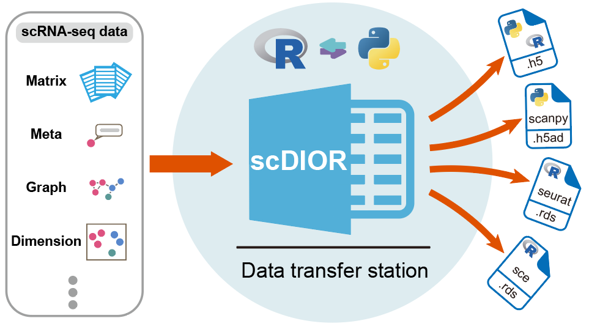

# scDIOR

scDIOR: Single cell RNA-seq  Data IO softwaRe

<br>

<h2 id="0">
    Directory
</h2>

* scDIOR
   * [Overview](#1)
   * [Installing scDIOR](#2)
      * [1. Conda environment](#2.1)
      * [2. Docker image](#2.2)
      * [Version control](#2.3)
   * [scDIOR demo](#3)
      * [1. Comparison of trajectory inferences](#3.1)
      * [2. Data IO for batch correction](#3.2)
      * [3. Data IO for spatial omics data](#3.3)
      * [4. Extended function](#3.4)
   * [Reference websites](#4)

___

<div id="1"></div>
## Overview  [](#0)

scDIOR software contains two modules, [dior]() for R and [diopy]() for Python. The data conversion was implemented by a ‘.h5’ file of [HDF5](https://www.hdfgroup.org/) format, which harmonizes the different data types between R and Python. The different aspects of single-cell information were stored in HDF5 group with dataset. scDIOR creates 8 HDF5 groups to store core single-cell information, including data, layers, obs, var, dimR, graphs, uns and spatial.   




**Our article：**  https://doi.org/10.1186/s12859-021-04528-3 

<div id="2"></div>
## Installing scDIOR[](#0)

Users install and  operate scDIOR following two ways:

1. The environment is created by `conda create` in which scDIOR is installed.
2. Docker images are available on the [jiekailab/scdior-image](https://hub.docker.com/r/jiekailab/scdior-image).

<div id="2.1"></div>
### 1. Conda environment

The environment is created by `conda create` in which dior and diopy are installed.

```shell
conda create -n conda_env python=3.8 R=4.0
```

1. R installation:

```R
# for R
install.packages('devtools')
devtools::install_github('JiekaiLab/dior')
# or devtools::install_github('JiekaiLab/dior@HEAD')
```

2. Python installation:

```shell
# for python
pip install diopy
```

<div id="2.2"></div>
### 2. Docker image

It is recommend to perform scDIOR in docker image, which ensures that the operating environment remains stable. scDIOR image is available on the [jiekailab/scdior-image](https://hub.docker.com/r/jiekailab/scdior-image).

**Brief description**

1. We first built the basic jupyter image which based on [jupyter/base-notebook](https://github.com/jupyter/docker-stacks) (jupyter managing Python and R) and [fixuid](https://github.com/boxboat/fixuid) (fixing user/group mapping issues in containers). This basic image is on [jiekailab/scdior-image:base-jupyter-notebook1.0](https://hub.docker.com/r/jiekailab/scdior-image/tags).
2. Based on our customized basic image, we built scDIOR image again by `Dockerfile`. For the content of `Dockerfile`, it is at this [link](https://github.com/JiekaiLab/scDIOR/blob/main/Dockerfile/Dockerfile).

The current latest image contains the following main analysis platforms and software: 

| R                    | version | Python  | version |
| :------------------- | ------- | ------- | ------- |
| R                    | 4.0.5   | Python  | 3.8.8   |
| Seurat               | 4.0.2   | Scanpy  | 1.8.1   |
| SingleCellExperiment | 1.12.0  | scvelo  | 0.2.3   |
| monocle3             | 1.0.0   | anndata | 0.7.6   |
| dior                 | 0.1.5   | diopy   | 0.5.2   |

<div id="2.3"></div>
### Version control

 At present, scDIOR is widely compatible with Seurat (v3\~v4) and Scanpy (1.4\~1.8) in different docker image. We configured multiple version docker image (https://hub.docker.com/repository/docker/jiekailab/scdior-image) to confirm that scDIOR can work well between multiple versions of Scanpy and Seurat.

[Demo link](https://github.com/JiekaiLab/scDIOR/tree/main/scdior_demo/Seurat4.0.5_Scanpy1.8.1/5.version_compatibility)

| Platform | Software | Version | data IO                 |
| -------- | -------- | ------- | ----------------------- |
| R        | Seurat   | v3~v4   | :ballot_box_with_check: |
| Python   | Scanpy   | 1.4~1.8 | :ballot_box_with_check: |

___

<div id="3"></div>

## scDIOR demo[](#0)

Here, we list several demos to show the powerful performance of scDIOR.

<div id="3.1"></div>

### 1. Comparison of trajectory inferences

Users can perform trajectory analysis using Monocle3 in R, then transform the single-cell data to Scanpy in Python using scDIOR, such as expression profiles of spliced and unspliced, as well as cell layout. The expression profile can be used to run dynamical RNA velocity analysis and results can be projected on the layout of Monocle3.

[Demo link](https://github.com/JiekaiLab/scDIOR/tree/main/scdior_demo/Seurat4.0.5_Scanpy1.8.1/1.trajectory_inference)


<div id="3.2"></div>

### 2. Data IO for batch correction

User can employ single-cell data preprocess and normalization method provided by Scanpy, and utilize batches correction method provided by Seurat.

[Demo link](https://github.com/JiekaiLab/scDIOR/tree/main/scdior_demo/Seurat4.0.5_Scanpy1.8.1/2.batch_correction)


<div id="3.3"></div>

### 3. Data IO for spatial omics data

scDIOR supports spatial omics data IO between R and Python platforms.

[Demo link](https://github.com/JiekaiLab/scDIOR/tree/main/scdior_demo/Seurat4.0.5_Scanpy1.8.1/3.spatial_analysis)


<div id="3.4"></div>

### 4. Extended function

1. The function to load ‘.rds’ file in Python directly;
2. The function to load ‘.h5ad’ file in R directly;
3. Command line  

[Demo link](https://github.com/JiekaiLab/scDIOR/tree/main/scdior_demo/Seurat4.0.5_Scanpy1.8.1/4.scDIOR_extended_function)


___

<div id="4"></div>

## Reference websites [](#0)

1. jupyter docker stacks: 
   1. https://github.com/jupyter/docker-stacks
   2. https://jupyter-docker-stacks.readthedocs.io/en/latest/using/selecting.html
2. fixuid: https://github.com/boxboat/fixuid
3. Seurat: https://satijalab.org/seurat/index.html
4. monocle3: https://cole-trapnell-lab.github.io/monocle3/
5. Scanpy: https://scanpy.readthedocs.io/en/stable/index.html
6. Scvelo: https://scanpy.readthedocs.io/en/stable/index.html


