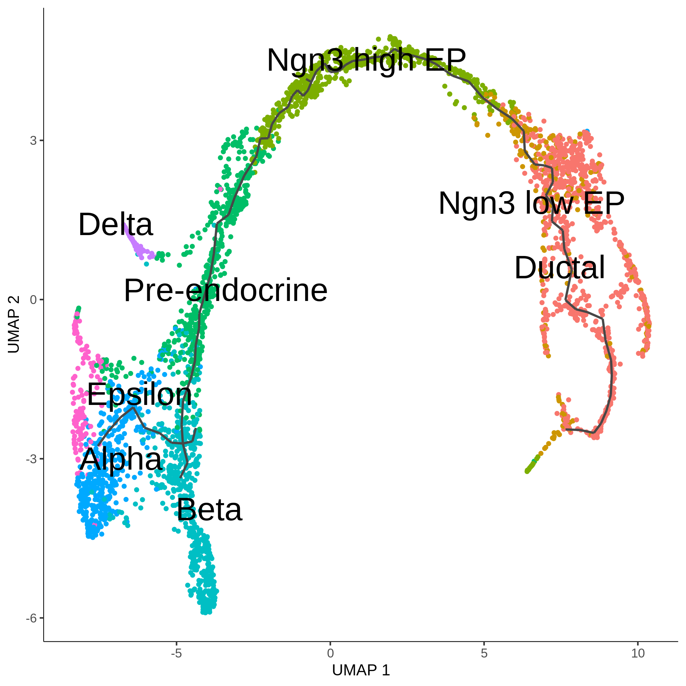
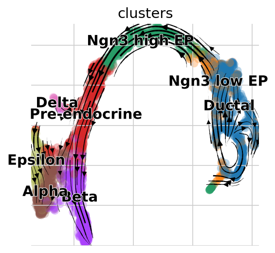

#  Comparison of trajectory inferences

Users can perform trajectory analysis using Monocle3 in R, then transform the single-cell data to Scanpy in Python using scDIOR, such as expression profiles of spliced and unspliced, as well as cell layout. The expression profile can be used to run dynamical RNA velocity analysis and results can be projected on the layout of Monocle3.

## Links

[1.h5ad_to_h5](https://fenghuijian.github.io/doc/scdior_demo/Seurat4.0.5_Scanpy1.8.1/1.trajectory_inference/1.1.h5ad_to_h5.html) 

shows that  the scanpy object was converted to the .h5 file by diopy.

[1.2.h5_to_monocle3_for_trajectroy_inference](https://fenghuijian.github.io/doc/scdior_demo/Seurat4.0.5_Scanpy1.8.1/1.trajectory_inference/1.2.h5_to_monocle3_for_trajectroy_inference.html) 

shows that the .h5 file was converted the SingleCellExperiment object (monocle3 object) by dior, trajectory analysis was preformed by monocle3, and the result was converted to the .h5 file by dior.

[1.3.velocity_vs_monocle3_of_trajectory_inference](https://fenghuijian.github.io/doc/scdior_demo/Seurat4.0.5_Scanpy1.8.1/1.trajectory_inference/1.3.velocity_vs_monocle3_of_trajectory_inference.html) 

shows that the .h5 file was converted to scanpy object by diopy and RNA velocity pipeline was preformed by `scvelo`.


## Demo

### Loading data with `scvelo` in `Python`

```python
# import 
import scanpy as sc
import diopy
import h5py
import anndata
import pandas as pd
import numpy as np
import scipy
import scvelo as scv
import os
%matplotlib inline
```

This data is curated by the `scvelo`

```python
# in python
adata = scv.datasets.pancreas()
adata
# AnnData object with n_obs × n_vars = 3696 × 27998
#     obs: 'clusters_coarse', 'clusters', 'S_score', 'G2M_score'
#     var: 'highly_variable_genes'
#     uns: 'clusters_coarse_colors', 'clusters_colors', 'day_colors', 'neighbors', 'pca'
#     obsm: 'X_pca', 'X_umap'
#     layers: 'spliced', 'unspliced'
#     obsp: 'distances', 'connectivities'
```


## Saving data with `diopy` in `Python`

```python
# in python
diopy.output.write_h5(adata = adata, 
                      file = './adata_fig3a.h5')
```


## Loading data with `dior` in `R`

````R
# library packages
library(Seurat)
library(SingleCellExperiment)
library(dior)
library(monocle3)
library(ggplot2)
````

Loading data

```R
# in R 
sce <- read_h5(file= './adata_fig3a.h5', 
              target.object = 'singlecellexperiment')
cds  <- new_cell_data_set(sce@assays@data@listData$X,
                         cell_metadata = colData(sce),
                         gene_metadata = rowData(sce))
```

* Constructing single-cell trajectories by `monocle3`. More details are available at [monocle3](https://cole-trapnell-lab.github.io/monocle3/docs/trajectories/)

1. Pre-process the data

```R
# in R 
cds <- preprocess_cds(cds, 
                      num_dim = 50)
```

2. Dimensionality reduction 

```R
# in R 
cds <- reduce_dimension(cds)
```

3. Clustering  the cells 

```R
# in R 
cds <- cluster_cells(cds, 
                     cluster_method= 'leiden')
```

4. Learning the trajectory graph and visualization

```R
# in R 
cds <- learn_graph(cds)
plot_cells(cds,
           color_cells_by = "clusters",
           label_groups_by_cluster=FALSE,
           label_leaves=FALSE,
           label_branch_points=FALSE,
           reduction_method = 'UMAP',
           cell_size = 1, 
           group_label_size =8)
```



5. Adding the Dimension

```R
# in R 
reducedDim(sce,'PCA') <- reducedDim(cds, 'PCA')
reducedDim(sce,'UMAP') <- reducedDim(cds, 'UMAP')
reducedDimNames(sce)<- c('pca','umap','PCAmonocle3','UMAPmonocle3')
```

## Saving data with`dior` in `R`

```R
# in R 
write_h5(data = sce, 
         file = './adata_monocle3_fig3a.h5', 
         assay.name = 'RNA' ,
         object.type = 'singlecellexperiment')
```


## Loading `adata_monocle3_fig3a.h5` with `diopy` in `Python`

```python
# in python 
adata = diopy.input.read_h5(file = './adata_monocle3_fig3a.h5')
```

* RNA Velocity analysis. More details are available at [scvelo](https://scvelo.readthedocs.io/VelocityBasics/)

1. Preprocess the Data

```python
# in python 
scv.pp.filter_and_normalize(adata, 
                            min_shared_counts=20, 
                            n_top_genes=2000)
scv.pp.moments(adata, 
               n_pcs=30, 
               n_neighbors=30)
```

2. Estimate RNA velocity

```python
# in python 
scv.tl.velocity(adata)
scv.tl.velocity_graph(adata)
```

3. Project the velocities

```Python
# in python 
scv.pl.velocity_embedding_stream(adata, 
                                 basis='umapmonocle3')
```




