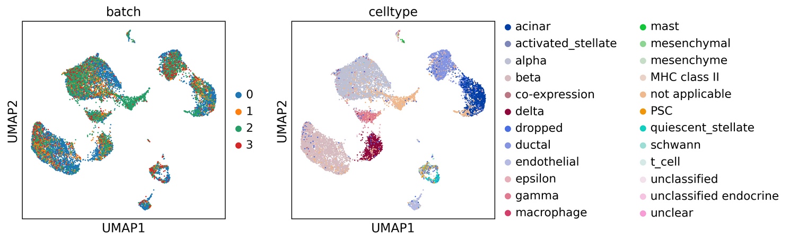

# Data IO for batch correction

Users can employ single-cell data preprocess and normalization method provided by Scanpy, and utilize batches correction method provided by Seurat.


## Links

[2.1.h5ad_to_h5](https://fenghuijian.github.io/doc/scdior_demo/Seurat4.0.5_Scanpy1.8.1/2.batch_correction/2.1.h5ad_to_h5.html)

shows that scanpy object (with batch information) was converted to .h5 file by diopy.

[2.2.h5_to_seurat_for_batch_correction](https://fenghuijian.github.io/doc/scdior_demo/Seurat4.0.5_Scanpy1.8.1/2.batch_correction/2.2.h5_to_seurat_for_batch_correction.html)

shows that the h5 file was converted to the Seurat object by dior and batch correction was preformed by Suerat, and the result was converted to the .h5 file by dior.

[2.3.h5_to_scanpy_for_visualization](https://fenghuijian.github.io/doc/scdior_demo/Seurat4.0.5_Scanpy1.8.1/2.batch_correction/2.3.h5_to_scanpy_for_visualization.html)

shows that the .h5 file was converted to scanpy by diopy and the result of batch correction was visualized.


## Demo

### Loading data with `diopy`in `Python`

```python
# import
import scanpy as sc
import diopy
import h5py
import anndata
import pandas as pd
import numpy as np
import scipy
import scvelo as scv
import os
%matplotlib inline
```

The data is curated by `scanpy`, loaded by the code:

```python
# in python 
adata = sc.read('data/pancreas.h5ad',backup_url='https://www.dropbox.com/s/qj1jlm9w10wmt0u/pancreas.h5ad?dl=1')
```

1. Visualization

```python
# in python 
sc.pl.umap(adata, 
           color=['batch', 'celltype'], 
           palette=sc.pl.palettes.vega_20_scanpy)
```


### Saving data with `diopy` in `Python`

```python
# in python 
diopy.output.write_h5(adata, 
                      file = './adata_fig3b.h5', 
                      save_X=False) 
# Select not to save adata_all.X, because that's scale data,
```


### Loading data with `dior` in `R`

```R
# library packages
library(Seurat)
library(SingleCellExperiment)
library(dior)
library(monocle3)
library(ggplot2)
```

Loading data 

```R
# in R
adata <- read_h5(file = './adata_fig3b.h5',
                 assay.name = 'RNA', 
                 target.object = 'seurat')
adata@meta.data$batch <- as.character(adata@meta.data$batch)
```

* Batch effect corrected by Seurat protocol. More details are available at [Seurat](https://satijalab.org/seurat/articles/get_started.html)

1. Dataset preprocessing: Splitting the combined object into a list

```R
# in R
adata_list <- SplitObject(adata, 
                          split.by = "batch")
```

2. Dataset preprocessing:  Variable feature selection based on a variance stabilizing transformation (`"vst"`) 

```R
# in R
adata_list <- lapply(X = adata_list, FUN = function(x) {
    # x <- NormalizeData(x) The data is normal data and does not need to be normalized
    x <- FindVariableFeatures(x, 
                              selection.method = "vst", 
                              nfeatures = 2000)
})
```

3. Select integration features

```R
# in R
features <- SelectIntegrationFeatures(object.list = adata_list)
```

4. Integration of cell datasets

```R
# in R
adata_anchors <- FindIntegrationAnchors(object.list = adata_list,
                                     anchor.features = features)
adata_combined <- IntegrateData(anchorset = adata_anchors)
```

5.  Downstream analysis for Integration data

```R
# in R
DefaultAssay(adata_combined) <- "integrated"
adata_combined <- ScaleData(adata_combined, verbose = FALSE)
adata_combined <- RunPCA(adata_combined, npcs = 30, verbose = FALSE)
adata_combined <- RunUMAP(adata_combined, reduction = "pca", dims = 1:30)
```

6.  Visualization 

```R
# in R 
options(repr.plot.width=20, repr.plot.height=8)
DimPlot(adata_combined, reduction = "umap", group.by = c("batch", 'celltype'))
```


### Saving data with `dior` in `R`

```R
write_h5(data = adata_combined, 
         file = paste0('./adata_seuratBC_fig3b.h5'),
         object.type = 'seurat'
         )
```


### Loading data with `diopy` in Python

```shell
adata = diopy.input.read_h5(file = './adata_seuratBC_fig3b.h5')
```

```python
sc.settings.set_figure_params(dpi=150,facecolor='white')
sc.pl.umap(adata, color=['batch', 'celltype'])
```



