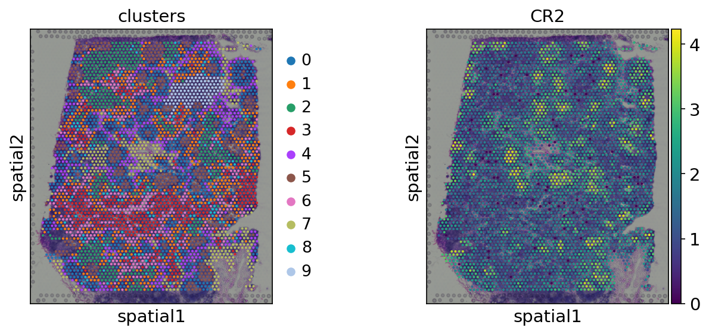
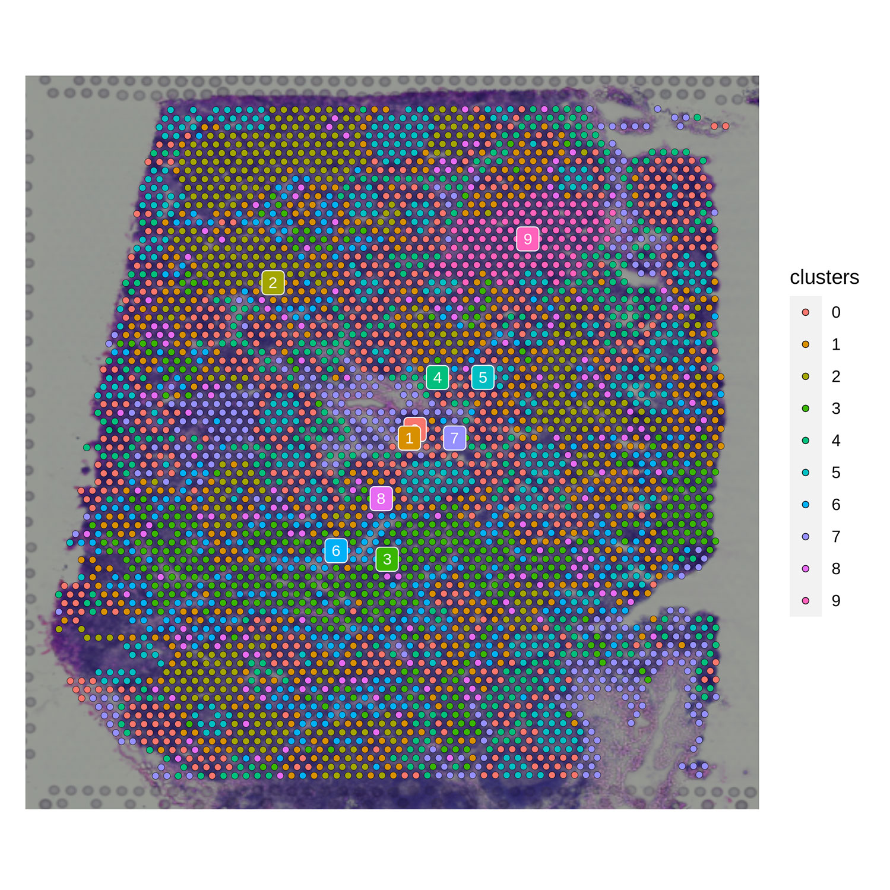
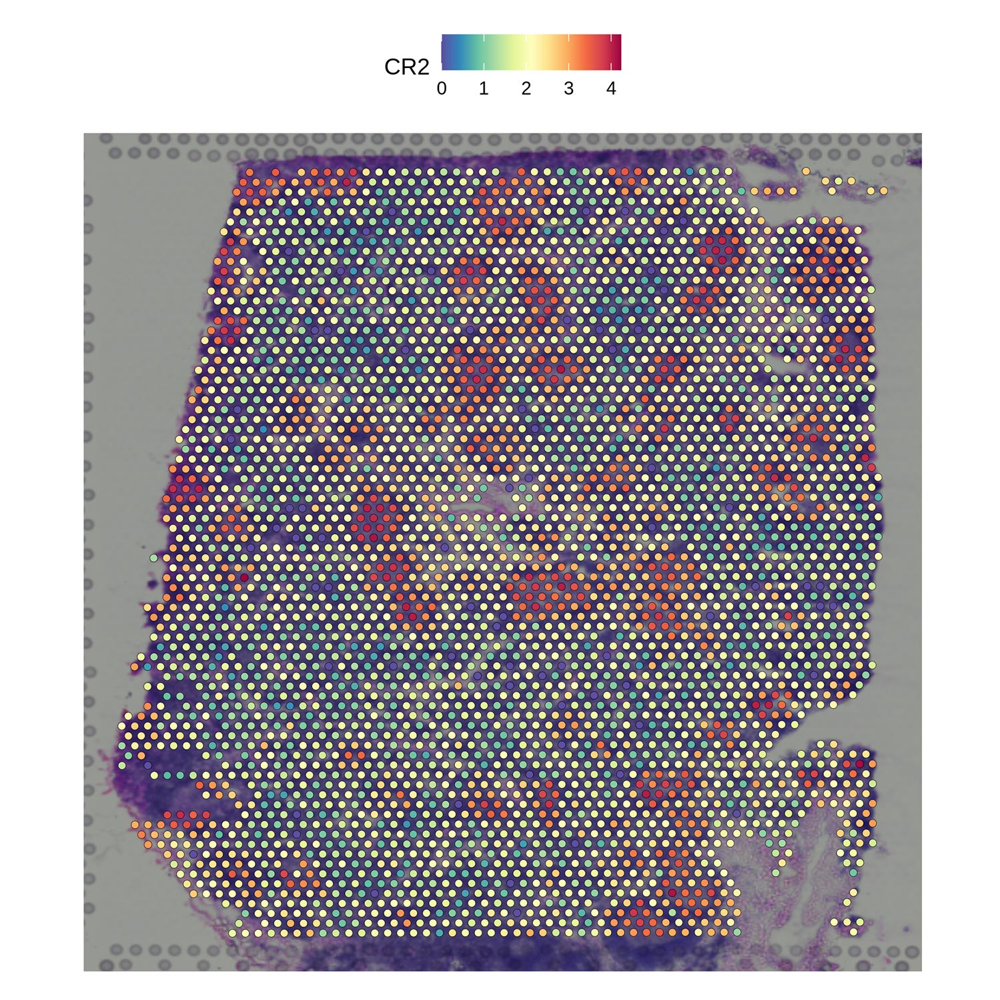

# Data IO for spatial omics data

scDIOR supports spatial omics data IO between R and Python platforms.


## Link

[3.1.scanpy_spatial_analysis](https://fenghuijian.github.io/doc/scdior_demo/Seurat4.0.5_Scanpy1.8.1/3.spatial_analysis/3.1.scanpy_spatial_analysis.html)

shows that the spatial data was analyzed by Scanpy and the result was converted to .h5 file by diopy.

[3.2.spatial_data_from_scanpy_to_seurat](https://fenghuijian.github.io/doc/scdior_demo/Seurat4.0.5_Scanpy1.8.1/3.spatial_analysis/3.2.spatial_data_from_scanpy_to_seurat.html)

shows that the .h5 file was converted to seurat object by dior.


## Demo

### Loading data from 10X Genomics Spatial Datasets

Downloading the spatial data set from [10X Genomics Spatial Datasets](https://support.10xgenomics.com/spatial-gene-expression/datasets)

* Analysis and visualization of spatial transcriptomics data by [scanpy spatial](https://scanpy-tutorials.readthedocs.io/en/latest/spatial/basic-analysis.html)

1. Reading the data

```python
# in python
adata = sc.read_visium('./data/V1_Human_Lymph_Node')
adata.var_names_make_unique()
adata.var["mt"] = adata.var_names.str.startswith("MT-")
sc.pp.calculate_qc_metrics(adata, qc_vars=["mt"], inplace=True)
```

2. QC and preprocessing

```python
# in python
sc.pp.filter_cells(adata, min_counts=5000)
sc.pp.filter_cells(adata, max_counts=35000)
adata = adata[adata.obs["pct_counts_mt"] < 20]
print(f"#cells after MT filter: {adata.n_obs}")
sc.pp.filter_genes(adata, min_cells=10)
```

3.  Normalize Visium counts data 

```python
# in python
sc.pp.normalize_total(adata, inplace=True)
sc.pp.log1p(adata)
sc.pp.highly_variable_genes(adata, flavor="seurat", n_top_genes=2000)
```

4. Manifold embedding and clustering 

```python
# in python
sc.pp.pca(adata)
sc.pp.neighbors(adata)
sc.tl.umap(adata)
sc.tl.leiden(adata, key_added="clusters")
```

5. Visualization in spatial coordinates

```python
# in python
sc.pl.spatial(adata, img_key="hires", color=["clusters", "CR2"], save='.spatial_py_cluster_gene.png')
```



<div id="6.2"></div>

### Saving data with`diopy` in `Python`

```python
# in python
diopy.output.write_h5(adata=adata, 
                      file='./adata_fig3c.h5',
                      assay_name='spatial')
```

<div id="6.3"></div>

### Loading data with `dior` in `R`

```R
# in R
adata = read_h5(file = './adata_fig3c.h5', 
                assay.name = 'spatial')
```

1. Visualization in spatial coordinates

```R
# in R
options(repr.plot.width=8, repr.plot.height=8)
SpatialDimPlot(adata, 
               label = TRUE, 
               label.size = 3, 
               group.by='clusters',  
               pt.size.factor = 1)
```



```R
# in R
SpatialFeaturePlot(adata, 
                   features = c('CR2'), 
                   pt.size.factor = 1)
```



<div id="6.4"></div>

### Saving data with `dior` in `R`

```R
# in R
write_h5(adata, 
         file = './adata_fig3c.h5', 
         assay.name = 'spatial')
```

load the data by diopy in Python

```python
# in python
adata = diopy.input.read_h5(file = './adata_fig3c.h5',
                            assay_name='spatial')
```


